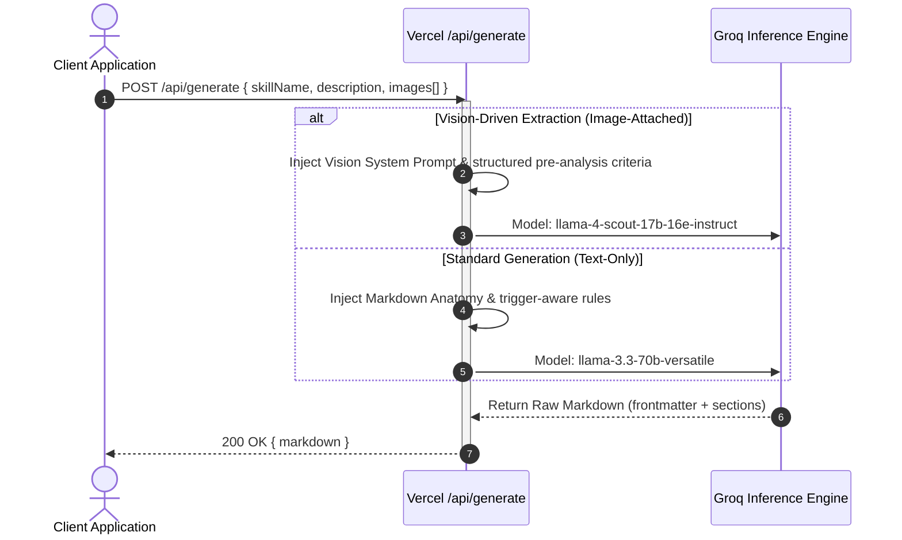
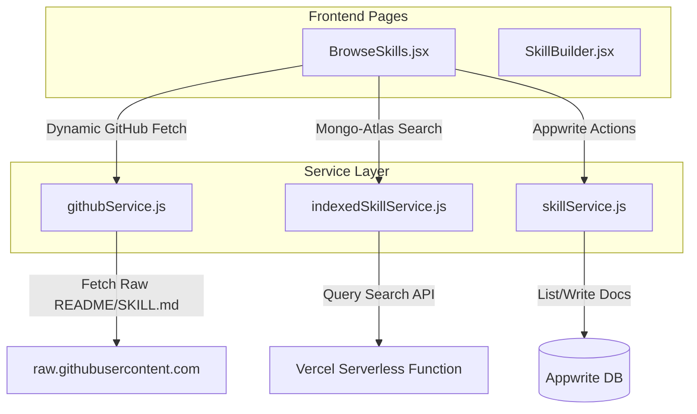

# System Architecture Documentation — Skill Issue

Skill Issue is a production-grade, highly-optimized AI skills marketplace. It enables developers and AI practitioners to discover, build, share, and combine AI skills (structured `.md` instruction files) for agents such as Claude, ChatGPT, Gemini, and Cursor.

This document describes the high-level architecture, design patterns, folder structure conventions, data flow, component boundaries, and overall architectural paradigm.

---

## 🏗️ High-Level System Architecture

Skill Issue uses a **decoupled hybrid architecture** that combines a high-performance Single Page Application (SPA) on the client side, dynamic serverless execution on Vercel, and a dual-data-tier architecture utilizing both **Appwrite Cloud** and **MongoDB Atlas**.

```mermaid
graph TD
    %% Client Tier
    subgraph Client Tier (SPA)
        Browser[User Browser]
        ReactApp[React SPA / Router v7]
        AuthCtx[AuthContext / Local Auth Mock]
        V_Modals[Global Modals: Auth, Onboarding]
        
        Browser <--> ReactApp
        ReactApp <--> AuthCtx
        ReactApp <--> V_Modals
    end

    %% API Gateway & Serverless Tier
    subgraph API & Serverless Tier (Vercel)
        API_Route_GH[Vercel Serverless: /api/github-skills]
        API_Route_Gen[Vercel Serverless: /api/generate]
        API_Route_Sitemap[Vercel Serverless: /api/sitemap.xml]
        API_Route_Cron[Vercel Serverless Cron: /api/cron/index-skills]
    end

    %% Data & Third-Party Tier
    subgraph Backend & DB Platforms
        direction LR
        AppwriteDB[(Appwrite Database)]
        AppwriteAuth[Appwrite Auth / OAuth]
        AppwriteStorage[(Appwrite Avatars Bucket)]
        MongoAtlas[(MongoDB Atlas)]
        GroqAPI[Groq Inference API]
        GitHubAPI[GitHub REST/GraphQL APIs]
    end

    %% Connections
    ReactApp <-->|Direct Database & Profile Query| AppwriteDB
    AuthCtx <-->|Session & OAuth| AppwriteAuth
    ReactApp <-->|Profile Uploads| AppwriteStorage
    
    ReactApp <-->|HTTP GET Search| API_Route_GH
    ReactApp <-->|HTTP POST Skill Generation| API_Route_Gen
    
    API_Route_GH <-->|High-Speed Query| MongoAtlas
    API_Route_Gen <-->|LLM Prompt Orchestration| GroqAPI
    API_Route_Sitemap <-->|Fetch Dynamic Sitemap URLs| MongoAtlas
    
    API_Route_Cron <-->|Partitioned Code Search & Trees SCAN| GitHubAPI
    API_Route_Cron <-->|Bulk Write Upsert| MongoAtlas
```

---

## 🗃️ Dual-Backend & Database Strategy

To balance fast development, social features, and massive indexed skill search, the application employs a dual-database model:

### 1. Client-to-Appwrite Data Path (Operational Tier)
* **Auth & Profile Management**: Realized using the Appwrite Web SDK directly from the frontend. It supports Google OAuth and standard email-based auth. In local or offline environments, a fallback toggle (`USE_MOCK_AUTH`) bypasses the connection, utilizing standard mock identities so that local frontend developers remain unblocked.
* **User Tables**:
  * `users`: Profiles, custom bios, display names, and onboarding state.
  * `skills`: User-uploaded or built skills (supporting fields for visibility, tags, copy_count, download_count, star_count, etc.).
  * `testimonials`: Seeded user testimonials displayed on the landing page.
* **Storage Bucket**: An `avatars` bucket manages custom user profile picture assets.

### 2. API-to-MongoDB Atlas Data Path (Discovery Tier)
* **Indexed GitHub Skills**: Because querying MongoDB directly from a browser is insecure, a dedicated Vercel Serverless function (`/api/github-skills`) mediates client requests. It handles complex, high-throughput text searching, paging, and sorting.
* **High-Speed Regex Search**: Weighted searches across fields (`skill_name` > `owner` > `repo` > `repo_description`) bypass standard text indexes to enable partial-word matches (e.g., matching `"stan"` to `"standards"`). This handles thousands of dynamic records with sub-100ms response times.
* **Session-Level In-Memory Cache**: A lightweight cache with a 5-minute TTL (`src/lib/indexedSkillService.js`) minimizes duplicate API hits during pagination and back-navigation.

---

## 🤖 AI Generation & LLM Orchestration

The dynamic core of Skill Issue is the **AI Skill Builder** (`/api/generate.js`), powered by **Groq**.



### Prompt Engineering Guardrails
1. **Anatomy Enforcement**: Every output enforces frontmatter headers and standard sections (`Purpose`, `When to Use This Skill`, `Instructions` in imperative forms, `Edge Cases`, `Worked Examples` without placeholders).
2. **Trigger-Aware Descriptions**: Descriptions are constructed as direct prompts to downstream AI agents, utilizing slightly pushy directives like *"Use this skill whenever the user mentions X..."* to trigger agentic action.
3. **Double-Pass Vision Extraction**: Vision-based requests trigger a thorough visual pre-analysis (colors, typography, component layouts, design systems) that maps screenshots into detailed, text-based specifications. Naive comparisons to screenshots are explicitly forbidden.

---

## 🌐 Prerendering & SEO Architecture

One of the application's most critical optimizations is the **Puppeteer-free static prerendering pipeline** (`scripts/prerender.mjs`).

* **Concept**: Typical SPA applications fail to index well on search engines because they rely heavily on client-side JS. Headless browser prerendering is slow and resource-heavy.
* **Solution**: A custom post-build Node.js script parses `dist/index.html` produced by Vite, generates metadata blocks for specified paths (titles, canonical links, OG/Twitter tags, and complex JSON-LD structured schemas), and writes them directly to route-specific index paths (e.g., `dist/browse/index.html`).
* **Dynamic Page Prerendering**: When `MONGODB_URI` is supplied during build time, the prerenderer queries MongoDB Atlas, fetches the top 200 starred GitHub-indexed skills, and outputs pre-compiled index sheets for each under `dist/skill/github/`.
* **Crawler Isolation**: The main React shell contains a bot-detection snippet (`isBot`) that completely skips animations and splash screens for web crawlers, ensuring instant, accessible indexation and 100/100 Lighthouse performance.

---

## 🔄 Data Flow & Component Boundaries



* **Browse Pipeline**: `BrowseSkills.jsx` renders a list combining dynamic, discovered GitHub skills and community-created skills. Discovered skills display lightweight, paginated metadata. When a user opens a skill modal, the client issues a direct HTTP request to `raw.githubusercontent.com` to stream the markdown file on-demand, saving operational bandwidth and hosting storage.
* **Authentication Gate**: Guest users are permitted to view search results and a brief preview of the markdown. Detailed, fully rendered markdown views, file tree navigation, copying, saving, and exporting are gated behind a secure, blurred paywall managed by `AuthContext.jsx`.

---

## 🛠️ Design Patterns & Architecture Conventions

1. **Service Layer Separation**: Frontend components never make direct database operations. All calls are mediated through clean service wrappers under `src/lib/` (e.g., `userService.js`, `skillService.js`).
2. **Context State Pattern**: All auth actions, loading thresholds, onboarding triggers, and user identities are centralized in `AuthContext.jsx`.
3. **Responsive Shell Layout**: The layout features a desktop-focused sticky left Navbar and an optical desktop bottom navigation block, combined with an isolated, fixed `BottomNav` child inside the root node. This prevents mobile browser transformation overlays from breaking `position: fixed` declarations.
4. **Declarative View Modality**: The skill view modal dynamically pivots between three rendering pipelines: pretty parsed HTML (`rendered`), visual interactive file explorers (`files`), and standard monospace syntax-highlighted blocks (`raw`).
