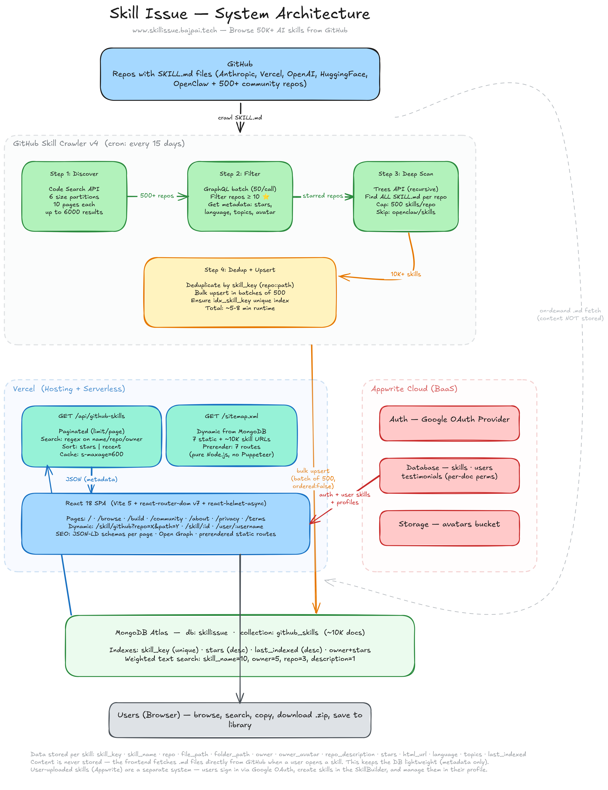

# skill issue.

> Does your AI agent have a skill issue? Probably.

Skill Issue is where you find, build, and share `.md` skill files that make AI agents actually good at specific tasks. Over 10,000 skills indexed from GitHub, searchable in one place.

You're a developer dropping skill files into Cursor? A teacher pasting instructions into a Custom GPT? Doesn't matter. Same idea: give your AI a skill file, it stops guessing and starts doing.

**Live at [skillissue.bajpai.tech](https://www.skillissue.bajpai.tech)**

---

## what even is a skill file?

A `.md` file with instructions that tell your AI how to behave for a specific task. Instead of explaining everything from scratch every conversation, you drop in a skill and it just knows.

No code. No prompt engineering degree required.

<p align="center">
  
</p>

The LLM reads only the skill name and a short description to decide relevance. The full SKILL.md (often thousands of tokens) loads only when it actually matches. Token efficient by design.

---

## what you can do

- Browse 10,000+ skills from Anthropic, Vercel, OpenAI, HuggingFace, and hundreds of community repos
- Build your own skill by describing what you want in plain English. The AI writes the SKILL.md for you
- Download as `.zip` or copy straight to clipboard
- Save privately to your vault or publish for everyone
- Combine multiple skills into a single package
- Share any skill with a direct link

---

## who actually uses this

A lawyer who wants their AI to draft contracts without hallucinating case law. A teacher who needs better student notices. A YouTuber tired of scripts that sound like a robot wrote them. A developer whose coding agent keeps making the same mistakes.

All of them end up here for the same reason: they want their AI to be better at one specific thing, and a skill file does that.

---

## architecture

The system has two separate data pipelines. The crawler finds skills on GitHub and stores metadata in MongoDB. The frontend fetches actual skill content directly from GitHub when you open one. Content is never stored, only metadata.

<p align="center">
  
</p>

**How the crawler works:**

A cron job runs every 15 days. It hits GitHub's Code Search API with 6 size partitions (up to 6000 results), filters repos through GraphQL batches (50 per call, minimum 10 stars), then deep scans each repo with the Trees API to find every SKILL.md file. Deduplicates by `repo::path`, bulk upserts into MongoDB in batches of 500. The whole run takes about 5-8 minutes.

---

## the stack

| Layer | Tech |
|---|---|
| Frontend | React 18 + Vite 5 + Tailwind CSS |
| Skill Index | MongoDB Atlas (~10K docs, weighted text search) |
| Crawler | Node.js serverless (Code Search + GraphQL + Trees API) |
| User Backend | Appwrite Cloud (auth, database, storage) |
| Auth | Google OAuth via Appwrite |
| AI (Skill Builder) | Groq - Llama 4 Scout + Llama 3.3 70B |
| Hosting | Vercel (SPA + serverless API routes) |
| SEO | Prerendered static routes, dynamic sitemap (10K+ URLs) |
| Domain | [skillissue.bajpai.tech](https://www.skillissue.bajpai.tech) |

---

## where skills come from

Skills are crawled from GitHub repos that contain SKILL.md files. The index currently pulls from:

- [Anthropic](https://github.com/anthropics/skills) - official
- [Vercel](https://github.com/vercel-labs/agent-skills) - official
- [OpenAI](https://github.com/openai/skills) - official
- [HuggingFace](https://github.com/huggingface/skills) - official
- [OpenClaw](https://github.com/openclaw/skills) - community (500+ skills)
- [Composio](https://github.com/ComposioHQ/awesome-claude-skills) - community
- Plus hundreds of other repos discovered automatically by the crawler

Users can also build and publish their own skills directly on the platform.

---

## how to use a skill

**If you use ChatGPT, Gemini, or Claude:**
1. Find a skill
2. Copy it
3. Paste into your Custom GPT, Gem, or Claude Project instructions
4. That's it

**If you use Cursor, Windsurf, or Claude Code:**
1. Find a skill
2. Download the `.zip`
3. Drop it into your `.agents/` or `skills/` directory
4. That's it

---

## running locally

```bash
git clone https://github.com/heyabhishekbajpai/SkillIssue
cd SkillIssue
npm install
```

Create a `.env` file:

```env
# Appwrite - https://cloud.appwrite.io
VITE_APPWRITE_ENDPOINT=https://cloud.appwrite.io/v1
VITE_APPWRITE_PROJECT_ID=your_project_id
VITE_APPWRITE_DATABASE_ID=skill-issue-db
VITE_APPWRITE_USERS_TABLE_ID=users
VITE_APPWRITE_SKILLS_TABLE_ID=skills
VITE_APPWRITE_AVATARS_BUCKET_ID=avatars

# Groq - https://console.groq.com
VITE_GROQ_API_KEY=your_groq_api_key

# GitHub (optional, bumps rate limit from 60 to 5000 req/hr)
VITE_GITHUB_TOKEN=your_github_token

# MongoDB (needed for /api routes and crawler)
MONGODB_URI=your_mongodb_connection_string

# Crawler auth
CRON_SECRET=your_cron_secret
```

```bash
npm run dev
```

Open [http://localhost:5173](http://localhost:5173)

> [!NOTE]
> If Appwrite isn't configured, the app falls back to a local mock user. You can still develop and test the UI without a live backend.

---

## contributing

Got a skill worth sharing? Build it on [skillissue.bajpai.tech](https://www.skillissue.bajpai.tech) and publish. No PRs needed.

Want to contribute to the codebase? Issues and PRs are welcome.

---

## the name

Yes, it's a meme. Yes, it's intentional.

Your AI has a skill issue. This fixes that.

---

## made by

[Abhishek Bajpai](https://bajpai.tech) · [GitHub](https://github.com/heyabhishekbajpai)

---

<p align="center">
  
  <br/>
  <i>boost your AI productivity by up to 70%</i>
</p>